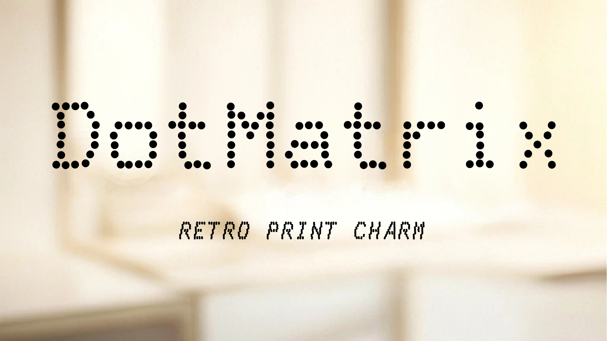
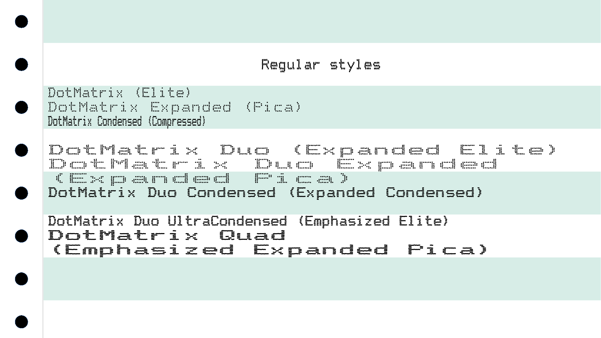

# DotMatrix

**DotMatrix** is a font inspired by the dot matrix printers of the 1980s, capturing the essence of the printing technologies from that era. It is ideal for evoking a retro or nostalgic feel, rendering ASCII/ANSI art, or use in code editors. For true scale, use **10 point text**.

This font includes:

* 537 characters, including the full set from the Epson FX-80 printer, DOS code page 437, Google Fonts Latin Core, Greek Core, Cyrillic Core, and Hebrew.

* Comprehensive modes of the Epson FX-80 printer, mapped as follows:
  
  |Epson FX-80 Mode|DotMatrix Font Family|
  |------------|---|
  |Pica|DotMatrix|
  |Elite|DotMatrix Expanded|
  |Compressed|DotMatrix Condensed|
  |Expanded Pica|DotMatrix Double|
  |Expanded Elite|DotMatrix Double Expanded|
  |Expanded Compressed|DotMatrix Double Condensed|
  |Emphasized Pica| DotMatrix Double UltraCondensed|
  |Emphasized Expanded Pica|DotMatrix Quad|

* **"Double-strike"** is represented by the Bold style.
* **"Italic"** corresponds to the Italic style.
* **"Proportional mode"** is mapped to the respective Var font families.

Additionally, **DotMatrix** includes two variable axes:

* **Element Size**: Adjusts the dot strength.
* **Horizontal Element Spacing**: Modifies the font width.

## Samples

# Releases

## 1.000

* First release.

## Build

To build the font, ensure you have Python 3.10 or newer, pip, and virtualenv installed. Then, execute:

    ./build.sh

## Designer profile

Stefan Schmidt is an electrical engineer with graduate studies in signal processing, combined artistic languages and sociology. Fascinated by the interplay between the virtual and the real, his work probes the boundaries between perception and technology.

Learn more at [http://www.stefanschmidtart.com](http://www.stefanschmidtart.com).

## Acknowledgements

* The ASCII segment is based on the original Epson FX-80 character set. Thanks to [EPHEX-80](https://github.com/MurphyMc/EPHEX-80) and [E-Keet Epsom](https://fontstruct.com/fontstructions/show/192525/e_keet_epsom).
* The cyrillic font is inspired by the [Robotron dot matrix printer font](https://github.com/nzeemin/robotron-dotmatrix-font).
* Some characters take inspiration from [ImgWriter Draft](https://fontstruct.com/fontstructions/show/393784/imgwriter_draft).
* The Greek font design is influenced by [1541 Ultimate II](https://github.com/GideonZ/1541ultimate).

## License

This Font Software is licensed under the SIL Open Font License, Version 1.1. This license is available with a FAQ at: https://scripts.sil.org/OFL
